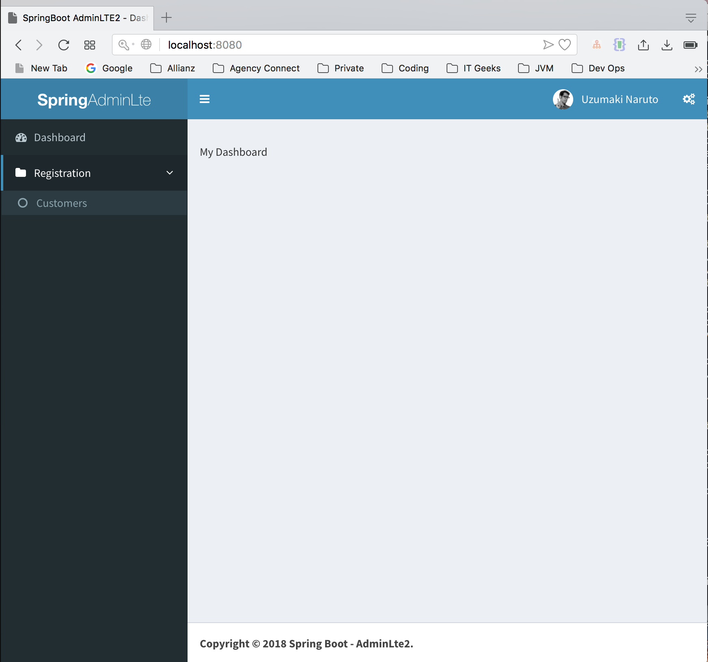
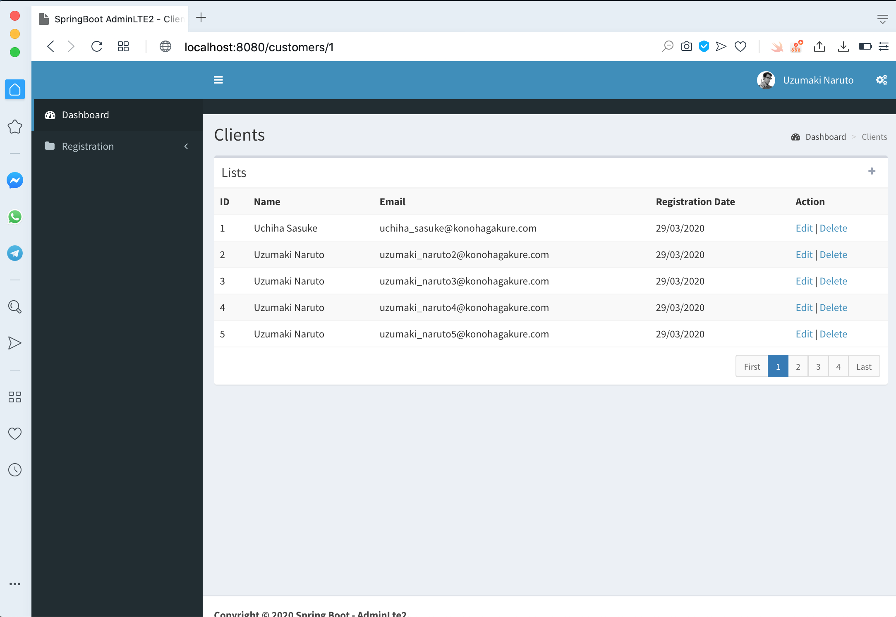

# SpringBoot with AdminLTE 2
---
nah untuk versi admin LTE ini akan coba aku update sesuai dengan yang aku inginkan nanti bentuknya dan bisa digunakan untuk apa saja.
untuk sumber aku mendapatkan apps ini dari reponya mas handika, nanti akan aku edit karena ini masih bersifat open source
Application with SpringBoot and the AdminLTE 2 template to facilitate development.

characteristics
---

* Spring Boot;
* Spring Security for basic login with permissions;
* Thymeleaf as view Template Engine;
* MySQL as Database or others;
* Basic customer CRUD;

TODO
---

* Search in the listing;
* Model of Dialog;
* Template for sending e-mail with template;

Run the application:
---
We assume that You already installed maven and JDK 8 (minimum) on your environment.
1. Clone the repository: `git clone https://github.com/hendisantika/spring-boot-adminlte.git`
2. Go to the folder: `cd spring-boot-adminlte`
3. Run the app: `mvn clean spring-boot:run`
4. Open Your favorite browser, then go to http://localhost:8080

It is free to make changes and implementations and make the code more evolved.

| #   | Username | Password |
| --- |:--------:| --------:|
| 1   | sasuke    | 1234     |
| 2   | naruto   | 1234     |

## Screenshot

Login Page

Dashboard Page

Add Customer Page

List Page

